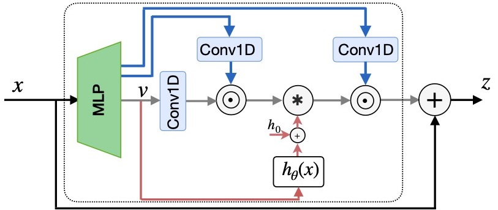
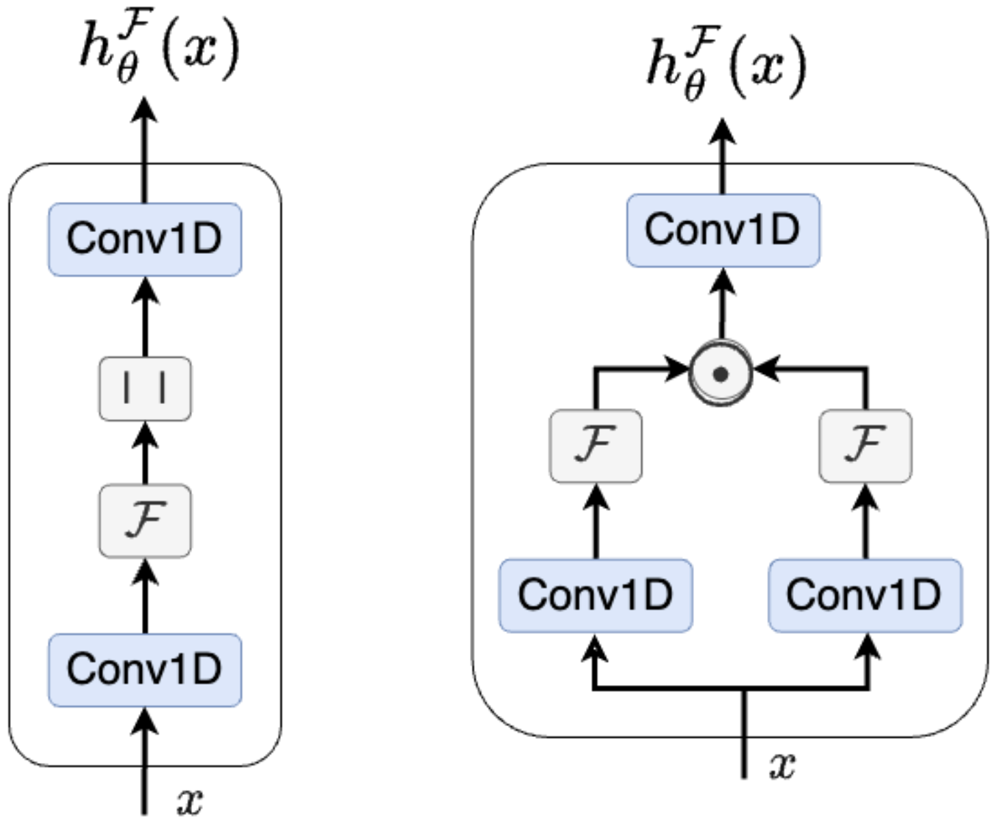

# Orchid: Flexible and Data-Dependent Convolution for Sequence Modeling
Official pytorch implementation for
**Orchid ([NeurIPS-2024](https://proceedings.neurips.cc/paper_files/paper/2024/hash/8ccc5ec30a8d46793d790e2216efd40d-Abstract-Conference.html), [arXiv](https://arxiv.org/abs/2402.18508) )**

> **Abstract**
In the rapidly evolving field of deep learning, the demand for models that are both expressive and computationally efficient has never been more critical. This paper introduces Orchid, a novel architecture designed to address the quadratic complexity of traditional attention mechanisms without compromising the ability to capture long-range dependencies and in-context learning. At the core of this architecture lies a new data-dependent global convolution layer, which contextually adapts its kernel conditioned on input sequence using a dedicated conditioning neural network. We design two simple conditioning networks that maintain shift equivariance in our data-dependent convolution operation. The dynamic nature of the proposed convolution kernel grants Orchid high expressivity while maintaining quasilinear scalability for long sequences. We evaluate the proposed model across multiple domains, including language modeling and image classification, to highlight its performance and generality. Our experiments demonstrate that this architecture not only outperforms traditional attention-based architectures such as BERT and Vision Transformers with smaller model sizes, but also extends the feasible sequence length beyond the limitations of the dense attention layers. This achievement represents a significant step towards more efficient and scalable deep learning models for sequence modeling.

| |  |
| :---: | :---: |
|	|  |


## Usage
A simple standalone implementation of the Orchid block is available in ```orchid_standalone/orchid_standalone.py```

## Dependencies
This package is mainly built upon:
`Python 3.8`, `PyTorch 2.1.1`

Rest of  dependencies can be installed via

  ```pip install -r requirements.txt```

## Cite
To cite this [paper](https://arxiv.org/abs/2402.18508):.

```
@article{karami2024orchid,
  title={Orchid: Flexible and data-dependent convolution for sequence modeling},
  author={Karami, Mahdi and Ghodsi, Ali},
  journal={Advances in Neural Information Processing Systems},
  volume={37},
  pages={76991--77022},
  year={2024}
}
```

This implementation adapts and used the code of [Hyena](https://github.com/HazyResearch/safari/tree/main).

## Questions/Bugs
Please, submit a Github issue.


